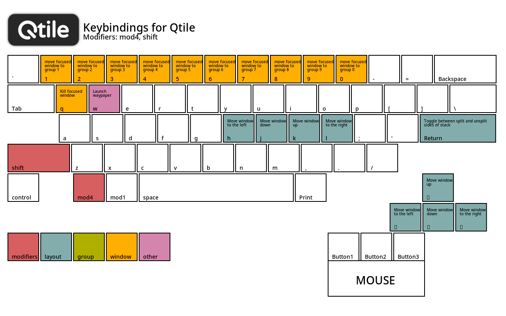
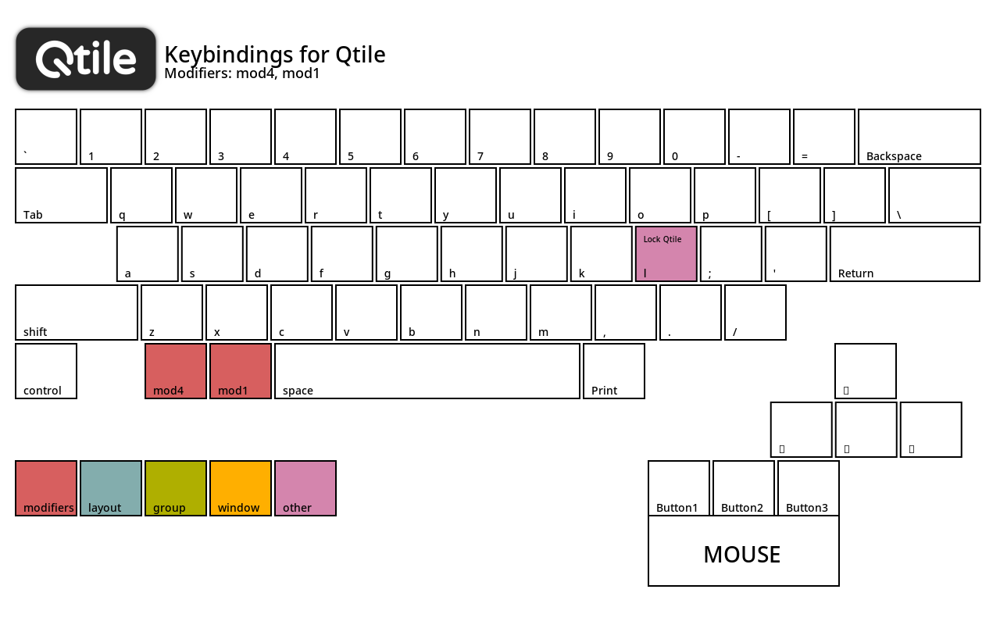
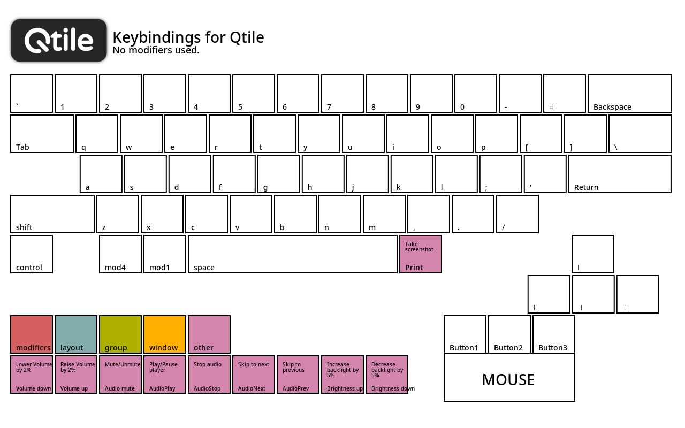

# Qtile Configuration

Work in progress.

Either use this qtile-config as is. Use the complete [dotfiles](https://github.com/Im-shamo/dotfiles) if you want my configurations as well.

Instead of rewriting my dotfiles README, I will just link it here

Go Here -> [README](https://github.com/Im-shamo/dotfiles/blob/main/README.md)
## Previews 


## Keybinds
<details>
<summary>Expand</summary>

Note >>> `ctrl` + `alt` + `Delete`: Powermenu <<<









</details>

## List of programs used in this qtile-config.

The commands in this mini guide is only for **Arch Linux or it's derivatives**. If it is something else, just follow the instructions and get the required packages. You may have to build from source if the programs are not available in the distro repos.


### Installation

#### Install from distro package repository.

Install `qtile` and all it's dependencies with `qtile-extras`. Also, install `xorg`, `xorg-xwayland`, `xorg-xrandr` and `wlr-randr`.

```bash
yay -S --needed qtile qtile-extras alsa-utils canto-daemon cmus khal libpulse lm_sensors python-aiohttp python-bowler python-dbus-fast python-isort python-iwlib python-keyring python-libcst python-mpd2 python-prompt_toolkit python-psutil python-pytz python-setproctitle python-pyxdg xorg-xwayland xorg-xrandr wlr-randr xorg
```


### Programs

Install in a fresh Arch Linux installation to avoid problems.

**Arch Linux Specific packages**.

- Terminal: `xterm`, `foot`
- Compositor: `picom`
- Web Browser: `brave-bin`<sup>AUR</sup>
- File Manager: `dolphin`
- Git: `git`
- Menu: `rofi`, [rofi configs](https://github.com/Im-shamo/rofi)
- Wallpaper: `waypaper`<sup>AUR</sup>, `feh`, `swww`
- Theming: `nwg-look`, `qt6ct-kde`<sup>AUR</sup>, `qt5ct-kde`<sup>AUR</sup> 
- Themes:
	- Cursor: [Tachibana Hikari](https://ko-fi.com/s/c124f987ab)
	- Cursor Help: [How to get cursor theming working in X11](https://gist.github.com/Im-shamo/64d7efba89db1a816c2c70e5ba01f770)
	- Cursor Tools: [Win -> Linux repo](https://github.com/khayalhus/win2xcur-batch)
	- Widgets: `breeze`, `breeze5`, `breeze-gtk`
	- Icons: `breeze-icons`
- Audio / Video Control: `playerctl`, `pavucontrol`, `alsa-utils`, `pipewire`, `pipewire-pulse`, `pipewire-alsa`, `wireplumber`
- Network: `networkmanager`, `network-manager-applet`
- Bluetooth: `blueman`
- Notifications: `dunst`
- Lock (Xorg): `powerkit`<sup>AUR</sup>, `xscreensaver`
- Lock (Wayland): `swayidle`, `swaylock`
- Keyring: `gnome-keyring`, `seahorse`
- Polkit Agent: `polkit-kde-agent`
- Resource Viewer: `btop`
- Screen Brightness: `brightnessctl`
- Disk Manager: `udiskie`
- Fonts: `noto-fonts`, `noto-fonts-cjk`, `noto-fonts-emoji`, `noto-fonts-extra`, `ttf-hack-nerd`, `otf-droid-nerd`
- Misc: `archlinux-xdg-menu`, `xdg-user-dirs`, `selectdefaultapplication-git`<sup>AUR</sup>

```bash  
yay -S --needed \
    xterm foot \
    picom \
    brave-bin \
    dolphin \
    git \
    rofi \
    waypaper feh swww \
    nwg-look qt6ct-kde qt5ct-kde \
    breeze breeze5 breeze-gtk breeze-icons \
    playerctl pavucontrol alsa-utils pipewire pipewire-pulse pipewire-alsa wireplumber \
    networkmanager network-manager-applet \
    blueman \
    dunst \
    powerkit xscreensaver \
    swayidle swaylock \
    gnome-keyring seahorse \
    polkit-kde-agent \
    btop \
    brightnessctl \
    udiskie \
    noto-fonts noto-fonts-cjk noto-fonts-emoji noto-fonts-extra ttf-hack-nerd \
    archlinux-xdg-menu xdg-user-dirs selectdefaultapplication-git
```
